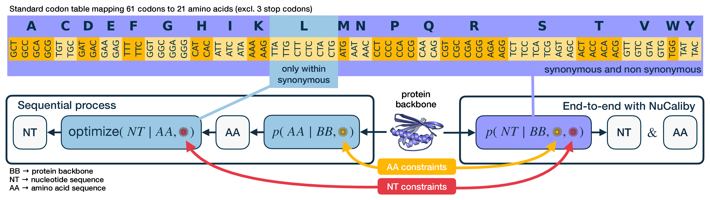
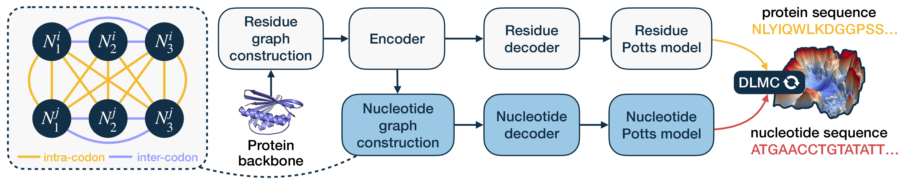

<p align="center">
  
</p>

<h1 align="center">NuCaliby <a href="https://www.biorxiv.org/content/10.64898/2026.10.05.756407v1">[📄 Paper]</a></h1>

<p align="center"><strong>Accepted at NeurIPS 2026</strong></p>

NuCaliby is a structure-conditioned nucleotide sequence design model. Given a protein backbone, it directly generates a coding DNA sequence whose translation is compatible with the target structure. Unlike post-hoc synonymous codon optimization, NuCaliby searches the full nucleotide sequence space and can jointly trade protein designability against nucleotide-level objectives such as host tRNA adaptation, RNA motif insertion, and mRNA thermodynamic stability. It can also operate directly in amino-acid space.

This repository contains the released checkpoint and the complete inference, evaluation, preprocessing, and training workflows.

NuCaliby builds on [Caliby](https://github.com/ProteinDesignLab/caliby), described in [*Ensemble-conditioned protein sequence design with Caliby*](https://doi.org/10.1101/2025.09.30.679633).



<p align="center"><em>Figure 1. NuCaliby jointly designs nucleotide and amino-acid sequences beyond synonymous optimization.</em></p>



<p align="center"><em>Figure 2. NuCaliby predicts residue- and nucleotide-level Potts models from a protein backbone.</em></p>

## Installation

Clone the repository with Git LFS enabled, then install the package:

```bash
git lfs install
git clone git@github.com:blazejba/NuCaliby.git
cd NuCaliby
python -m pip install .
```

The released model is `assets/nucaliby_v1.ckpt`.

Install optional Python dependencies for the workflows you intend to run:

```bash
python -m pip install '.[evaluation]'  # prepare folds and compute metrics
python -m pip install '.[vienna]'      # ViennaRNA guidance
python -m pip install '.[preprocessing]'
python -m pip install '.[train]'
```

Some workflows also call external executables that are not installed by pip:

- Folding: `colabfold_batch` from ColabFold.
- Structural metrics: `TMalign` from TM-align. The script reads TM-score and RMSD from its output; it does not use the separate `TMscore` program.
- Dataset clustering: `mmseqs` from MMseqs2.

Place these executables on `PATH`, or pass `--colabfold` and `--tmalign` explicitly. SLURM is only required for the supplied `.sbatch` launchers; the Python entry points can be run directly.

## Design a sequence

Design one coding sequence from a PDB or mmCIF backbone:

```bash
python scripts/inference/design.py \
    --ckpt assets/nucaliby_v1.ckpt \
    --pdb backbone.cif \
    --alphabet nt \
    --guide stop:weight=100 \
    --out designs.csv
```

Use `--alphabet aa` for amino-acid design. Chain A is designed by default; pass `--chains B` or `--chains all` to change the selection. Guidance objectives are repeatable:

```bash
# Adapt coding sequences to E. coli BL21(DE3)
--guide tai:weight=50,organism=bl21_de3

# Embed an RNA motif
--guide motif:file=assets/motifs/sira.txt,weight=50,beta=2

# Penalize mRNA folding energy (requires ViennaRNA)
--guide vienna:weight=10

# Penalize low-complexity protein sequences
--alphabet aa --guide lcp
```

Install `.[vienna]` for ViennaRNA guidance as described above.

## Reproduce the experiments

The shared evaluation set contains 183 structures listed in `assets/test_pdb_ids.txt`. Set `CLEAN_PDB_DIR` to a directory containing their PDB or mmCIF backbones. Results are written below `results/` by default; override this with `OUT=/path/to/results`.

The four standard structure-recovery variants use one sampled sequence per target:

| Variant | Make target | Design configuration |
|---|---|---|
| AA | `design-aa` | amino-acid design with low-complexity guidance |
| NT | `design-nt` | nucleotide design with stop-codon guidance |
| AA ensemble | `design-aa-ensemble` | AA configuration conditioned on a structural ensemble |
| NT ensemble | `design-nt-ensemble` | NT configuration conditioned on a structural ensemble |

```bash
export CLEAN_PDB_DIR=/path/to/backbones
make design-aa
make design-nt
make ensemble PDB=/path/to/backbone.pdb
make design-aa-ensemble ENSEMBLE_DIR=/path/to/ensembles
make design-nt-ensemble ENSEMBLE_DIR=/path/to/ensembles
```

### Backbone ensembles with Protpardelle-1c

Backbone ensembles are generated with [Protpardelle-1c](https://github.com/ProteinDesignLab/protpardelle-1c), described in [*Conditional Protein Structure Generation with Protpardelle-1C*](https://doi.org/10.1101/2025.08.18.670959) and building on [*An all-atom protein generative model*](https://doi.org/10.1073/pnas.2311500121).

The Protpardelle-1c checkpoint is included in this repository through Git LFS at
`assets/protpardelle-1c/weights/cc95_epoch3490.pth`, alongside its model configuration
at `assets/protpardelle-1c/configs/cc95.yaml`. Fetch the weights and install the optional generator:

```bash
git lfs pull
python -m pip install '.[ensemble]'
make ensemble PDB=/path/to/7qnl.cif
```

This uses the bundled weights and the paper's partial-denoising recipe (150 rewind steps) to generate 31 conformers
in `results/ensembles/7qnl/`. NuCaliby automatically adds the original backbone during design, giving a 32-member ensemble.

Use the generated ensembles for sequence design:

```bash
make design-aa-ensemble ENSEMBLE_DIR=results/ensembles
make design-nt-ensemble ENSEMBLE_DIR=results/ensembles
```

### Guidance experiments

Run the other reported guidance experiments with these Make targets:

```bash
make design-tai TAI_WEIGHT=50  # BL21(DE3) tAI guidance at one chosen weight
make design-motif-sira      # 16 designs per backbone
make design-motif-fse       # 16 designs per backbone
make design-motif-both      # both motifs, 16 designs per backbone
make design-vienna          # mRNA thermodynamic-stability guidance
```

### Folding and scoring

Fold and score an experiment by naming its result directory:

```bash
make fold ROW=nt
make metrics-paper ROW=nt
```

The same folding command handles multi-sample experiments. Use the general metrics target to score every supplied design without the paper-specific ID and chain filters:

```bash
make fold ROW=motif_sira
make metrics ROW=motif_sira
```

`scripts/inference/metrics.py` accepts arbitrary design sets. Use `--ids` and `--chains` to select an evaluation subset, `--group-by` to aggregate by any retained metadata column, and `--summary-out` to save the aggregate table. Without these options it scores and summarizes every row.

### Cluster resources

The supplied SLURM launchers use a generic partition named `gpu`; change that name if your cluster uses another GPU partition. Design and folding each request one GPU, 8 CPU cores, and 64 GB of system memory. A GPU with at least 16 GB of memory is sufficient for typical monomer design; ColabFold requirements depend on sequence length.

## Build the training dataset

Install the preprocessing dependencies. AtomWorks is pinned because its data representation is part of the reproducibility contract:

```bash
python -m pip install '.[preprocessing]'
```

The input is a local RCSB-style mirror containing `.cif` or `.cif.gz` files; subdirectories are searched recursively. Copy the environment template, set both paths, and source it so submitted SLURM jobs inherit the variables:

```bash
cp .env.example .env
# Edit .env, then:
source .env
```

Build and merge metadata first. After the merge job completes, example caching and sequence clustering are independent and may run concurrently:

```bash
sbatch scripts/preprocessing/build_metadata_parquet_shards.sbatch
sbatch scripts/preprocessing/merge_parquet_shards.sbatch
sbatch scripts/preprocessing/preprocess_examples.sbatch  # may run concurrently
sbatch scripts/preprocessing/cluster_sequences.sbatch    # may run concurrently
```

Metadata extraction and example caching are sharded arrays. Failed array indices can be resubmitted without rebuilding successful shards, but do not merge until every metadata shard exists. Do not reuse one output directory for different structure mirrors or preprocessing configurations. Sequence clustering requires `mmseqs` on `PATH`.

A complete data store contains:

```text
shards/metadata_shard_*.parquet
metadata.parquet
metadata_for_caching.parquet
cached_examples/<pdb_id>.pt
metadata_clustered.parquet
splits/
```

Before training, confirm that all expected shard files exist, the three metadata artifacts are non-empty, and cached examples were produced. The supplied launchers use the cluster's default CPU partition. Metadata extraction and example caching request 32 CPU cores and 128 GB per array task; clustering requests 64 cores and 256 GB. They default to 100 array tasks and 30 workers per task. Reduce the worker count together with the requested CPUs on smaller systems.

Four lists in `assets/training_lists/` define training-only partitions and filters. Identical copies are packaged with NuCaliby, so training can find them after a standard installation; preprocessing also copies them into the generated data store for provenance:

- `training_validation_pdb_ids.txt`: PDB IDs reserved for training validation.
- `excluded_transmembrane_pdb_ids.txt`: PDB IDs excluded from the soluble set.
- `excluded_unknown_residue_pdb_ids.txt`: structures with unsupported residues.
- `excluded_unknown_residue_chain_ids.txt`: individual chains with unsupported residues.

They are unrelated to the 183-structure test set in `assets/test_pdb_ids.txt`.

To use different lists, pass `--validation-ids path.txt` and repeat `--exclude-ids path.txt` for every exclusion file. Supplying any `--exclude-ids` arguments replaces the default set.

## Training

Install the training dependencies and launch eight-GPU training:

```bash
python -m pip install '.[train]'
sbatch scripts/training/train.sbatch \
    --data-root "$NUCALIBY_SOLUBLE_DATA_DIR" \
    --out-dir runs/nucaliby
```

The complete configuration used to train the released checkpoint is provided in [`assets/nucaliby_v1_training_config.yaml`](assets/nucaliby_v1_training_config.yaml).

The training launcher requests eight B200 GPUs, 12 CPU cores and 250 GB of system memory per GPU on the generic `gpu`
partition. For smooth execution at the default crop and batch size, use GPUs with at least 80 GB of memory. On other
clusters, edit the `#SBATCH` resources; the launcher detects the allocated GPU count automatically.

## Citation

Please cite our [bioRxiv preprint](https://www.biorxiv.org/content/10.64898/2026.10.05.756407v1):

```bibtex
@article{banaszewski2026nucaliby,
  title   = {Joint Protein, mRNA and DNA Sequence Design and Optimization with Nucleotide-Level Potts Models},
  author  = {Banaszewski, Blazej and Dornfeld, Lars J. and Chen, Dexiong and Borgwardt, Karsten and Milles, Lukas},
  journal = {bioRxiv},
  year    = {2026},
  doi     = {10.64898/2026.10.05.756407},
  url     = {https://www.biorxiv.org/content/10.64898/2026.10.05.756407v1}
}
```

## License

NuCaliby is released under the [MIT License](LICENSE).
